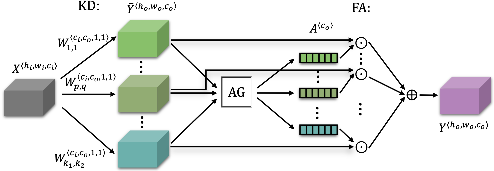
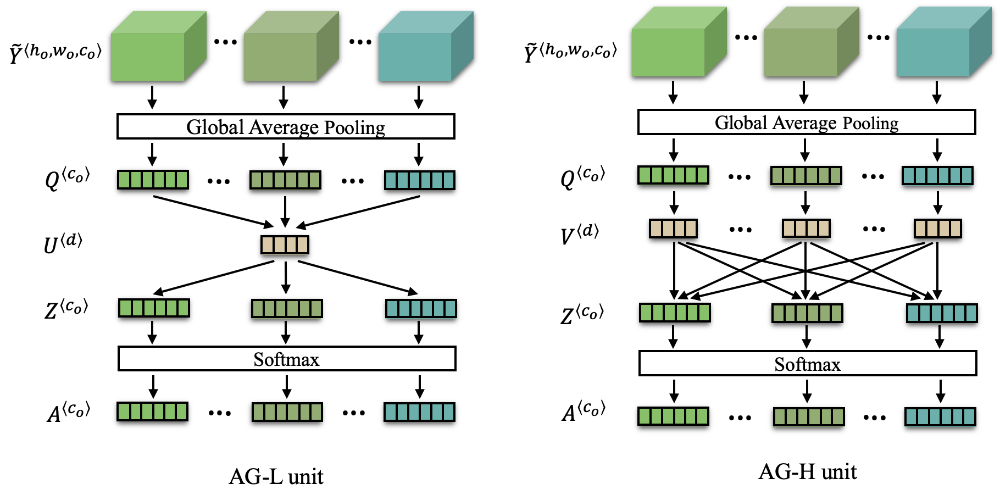

# KAConv: Kernel Attention Convolutions
[KAConv: Kernel attention convolutions](https://doi.org/10.1016/j.neucom.2022.10.017)

## Requirement
- `pytorch 1.1.0+`
- `torchvision`
- `tensorboard 1.14+`
- `numpy`
- `pyyaml`
- `tqdm`
- `pillow`

## Dataset
- `ImageNet-1K`

## Introduction
This is a PyTorch implementation of KAConv. 

KAConv embeds attention weights into convolution kernels, so that the model can dynamically adjust kernel parameters at different spatial positions of convolution kernel according to different inputs. 

## Method

 The architecture of KAConv. 

 The architecture of AG-L unit and AG-H unit. 

## Experiments
## Performance on ImageNet-1K of different baselines
| Architecture                |Top-1 error |Top-5 error |FLOPs  |params |
| ----                 | ----     | ----      | ----     |-----|
| ResNet50           | 23.30      | 6.79      | 4.11G      |25.56M|
| KAResNet50-L           | **22.27**        | **6.24**         | 4.15G        |27.83M|
| KAResNet50-H           | **21.92**        | **6.08**         | 4.16G        |35.56M|
||
| ResNet-101           | 22.28       | 6.10       | 7.84G      |44.55M|
| KAResNet101-L           | **21.80**        | **6.03**         | 7.90G        |49.44M|
| KAResNet101-H           | **21.28**        | **5.84**         | 7.92G        |66.08M|
||
| ResNeXt50           | 22.35      | 6.43       | 4.26G      |25.03M|
| KAResNeXt50-L           | **21.97**        | **6.24**         | 4.34G        |31.27M|
| KAResNeXt50-H           | **21.23**        | **6.02**         | 4.36G        |53.03M|
||
| MobileNetV2 .5x           | 35.62      | 14.55      | 138.46M   |1.97M|
| KAMobileNetV2-L .5x           | **33.72**        | **13.14**         | 180.52M        |4.15M|
| KAMobileNetV2-H .5x           | **33.09**        | **12.77**         | 189.00M        |11.69M|
||
| MobileNetV2 1x           | 28.09      | 9.66      | 315.41M   |3.5M|
| KAMobileNetV2-L 1x           | **26.83**        | **8.74**         | 378.71M        |9.31M|
| KAMobileNetV2-H 1x           | **27.01**        | **9.08**         | 401.46M        |29.52M|

### Usage
- Uncomment the `runid` attribute in the [config](configs/ka.yml) file
- download the pretrained weight (KAResNet50-L) from [here](https://drive.google.com/file/d/1M_GFdilcO78pD3sFhKbIBvrg7riM6zBU/view?usp=sharing).
- place the weight in `runs/ka/10086/best_model.pkl`.
- run `test,py`

## Todo
- Modify the source code of the convolutional layer
